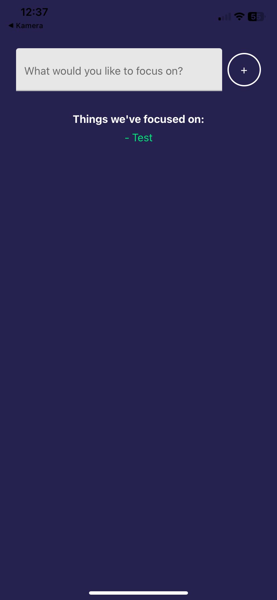
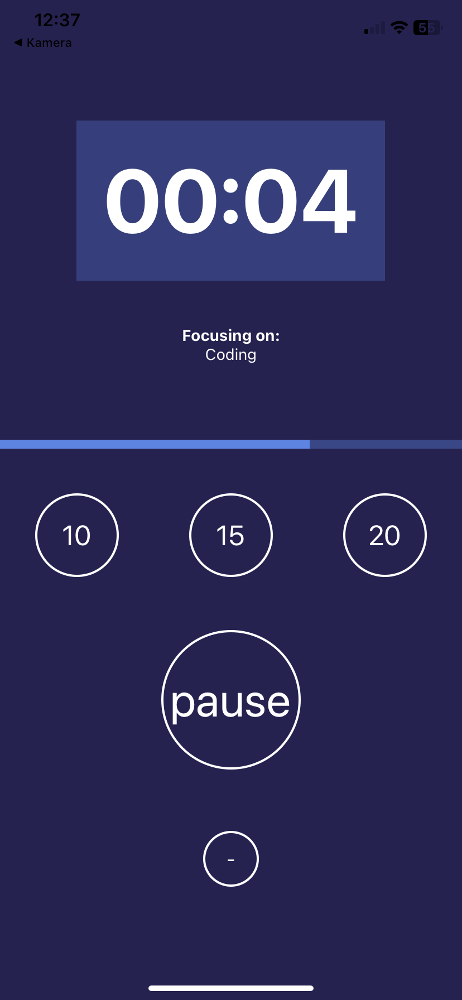
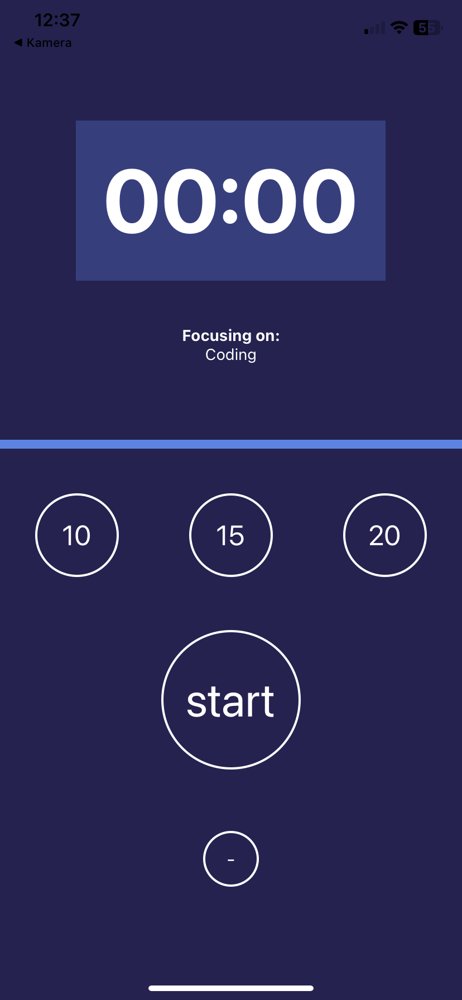

# Focus Timer App

## Overview

Focus Timer is a simple and effective productivity app designed to help you stay focused on specific tasks. It allows you to set a timer, track progress, and get notified when your focus session ends.

### Key Features:

- **Input Task:** Enter what you want to focus on.
- **Custom Timer:** Choose a focus duration (10, 15, or 20 minutes).
- **Progress Tracker:** Visualize your progress with a status bar.
- **Notifications:** Receive a phone vibration alert when the timer ends.
- **Task Status:** Completed tasks are displayed in green text.

This was my first React Native project, created as part of a training program.

## Screenshots

Here are some screenshots showcasing the app:

1. **Input Task Screen**
   

2. **Timer Selection Screen**
   

3. **Progress and Completion**
   

## Installation

1. Clone the repository:
   ```bash
   git clone https://github.com/SVMaxica/focus-timer.git
   ```
2. Navigate to the project directory:
   ```bash
   cd focus-timer
   ```
3. Install dependencies:
   ```bash
   npm install
   ```
4. Start the development server:
   ```bash
   npm start
   ```

## How to Use

1. Open the app and input the task you want to focus on.
2. Press the `+` button to navigate to the timer screen.
3. Select your desired focus duration (10, 15, or 20 minutes).
4. Press **Start** to begin the timer.
5. Track your progress using the status bar.
6. When the timer ends, your phone will vibrate, and the task status will display as completed in green.

## Technologies Used

- **React Native**
- **Expo**
- **TypeScript**
- **React Native Paper** for UI components

## Future Improvements

- Add customizable focus durations.
- Include a history log for completed tasks.
- Provide dark mode support.

## License

This project is licensed under the 0BSD License.

---

For any questions or feedback, feel free to reach out!
